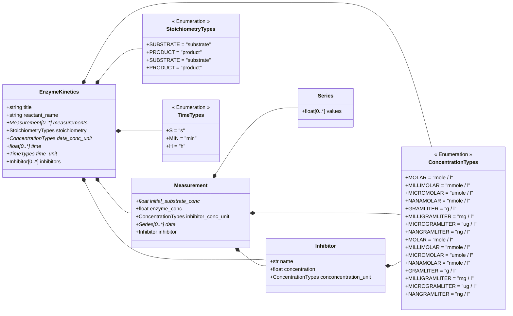

```mermaid
classDiagram
    direction LR
    EnzymeKinetics *-- Measurement
    EnzymeKinetics *-- StoichiometryTypes
    EnzymeKinetics *-- ConcentrationTypes
    EnzymeKinetics *-- TimeTypes
    EnzymeKinetics *-- Inhibitor
    Measurement *-- ConcentrationTypes
    Measurement *-- Series
    Measurement *-- Inhibitor
    Inhibitor *-- ConcentrationTypes
    
    class EnzymeKinetics {
        +string title
        +string reactant_name
        +Measurement[0..*] measurements*
        +StoichiometryTypes stoichiometry
        +ConcentrationTypes data_conc_unit*
        +float[0..*] time*
        +TimeTypes time_unit*
        +Inhibitor[0..*] inhibitors
    }
    
    class Measurement {
        +float initial_substrate_conc*
        +float enzyme_conc
        +ConcentrationTypes inhibitor_conc_unit
        +Series[0..*] data*
        +Inhibitor inhibitor
    }
    
    class Inhibitor {
        +str name
        +float concentration
        +ConcentrationTypes conconcentration_unit
    }
    
    class Series {
        +float[0..*] values
    }
    
    class StoichiometryTypes {
        << Enumeration >>
        +SUBSTRATE = "substrate"
        +PRODUCT = "product"
    }
    
    class StoichiometryTypes {
        << Enumeration >>
        +SUBSTRATE = "substrate"
        +PRODUCT = "product"
    }
    
    class ConcentrationTypes {
        << Enumeration >>
        +MOLAR = "mole / l"
        +MILLIMOLAR = "mmole / l"
        +MICROMOLAR = "umole / l"
        +NANAMOLAR = "nmole / l"
        +GRAMLITER = "g / l"
        +MILLIGRAMLITER = "mg / l"
        +MICROGRAMLITER = "ug / l"
        +NANGRAMLITER = "ng / l"
    }
    
    class ConcentrationTypes {
        << Enumeration >>
        +MOLAR = "mole / l"
        +MILLIMOLAR = "mmole / l"
        +MICROMOLAR = "umole / l"
        +NANAMOLAR = "nmole / l"
        +GRAMLITER = "g / l"
        +MILLIGRAMLITER = "mg / l"
        +MICROGRAMLITER = "ug / l"
        +NANGRAMLITER = "ng / l"
    }
    
    class TimeTypes {
        << Enumeration >>
        +S = "s"
        +MIN = "min"
        +H = "h"
    }
    
```