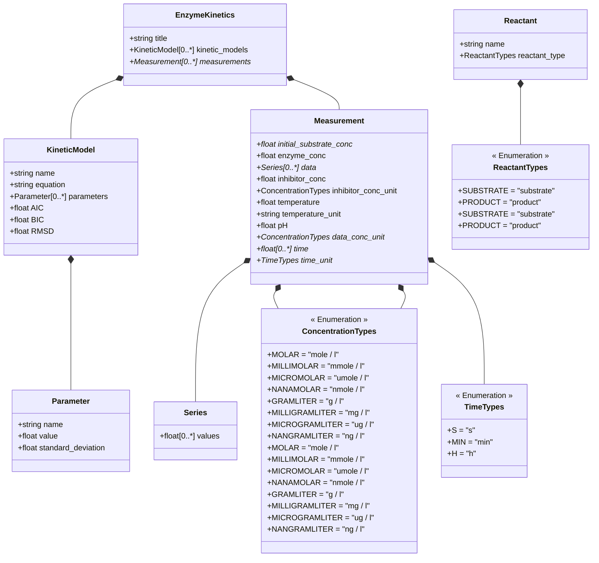

```mermaid
classDiagram
    EnzymeKinetics *-- KineticModel
    EnzymeKinetics *-- Measurement
    Reactant *-- ReactantTypes
    Measurement *-- Series
    Measurement *-- ConcentrationTypes
    Measurement *-- ConcentrationTypes
    Measurement *-- TimeTypes
    KineticModel *-- Parameter
    
    class EnzymeKinetics {
        +string title
        +KineticModel[0..*] kinetic_models
        +Measurement[0..*] measurements*
    }
    
    class Reactant {
        +string name
        +ReactantTypes reactant_type
    }
    
    class Measurement {
        +float initial_substrate_conc*
        +float enzyme_conc
        +Series[0..*] data*
        +float inhibitor_conc
        +ConcentrationTypes inhibitor_conc_unit
        +float temperature
        +string temperature_unit
        +float pH
        +ConcentrationTypes data_conc_unit*
        +float[0..*] time*
        +TimeTypes time_unit*
    }
    
    class KineticModel {
        +string name
        +string equation
        +Parameter[0..*] parameters
        +float AIC
        +float BIC
        +float RMSD
    }
    
    class Parameter {
        +string name
        +float value
        +float standard_deviation
    }
    
    class Series {
        +float[0..*] values
    }
    
    class ReactantTypes {
        << Enumeration >>
        +SUBSTRATE = "substrate"
        +PRODUCT = "product"
    }
    
    class ReactantTypes {
        << Enumeration >>
        +SUBSTRATE = "substrate"
        +PRODUCT = "product"
    }
    
    class ConcentrationTypes {
        << Enumeration >>
        +MOLAR = "mole / l"
        +MILLIMOLAR = "mmole / l"
        +MICROMOLAR = "umole / l"
        +NANAMOLAR = "nmole / l"
        +GRAMLITER = "g / l"
        +MILLIGRAMLITER = "mg / l"
        +MICROGRAMLITER = "ug / l"
        +NANGRAMLITER = "ng / l"
    }
    
    class ConcentrationTypes {
        << Enumeration >>
        +MOLAR = "mole / l"
        +MILLIMOLAR = "mmole / l"
        +MICROMOLAR = "umole / l"
        +NANAMOLAR = "nmole / l"
        +GRAMLITER = "g / l"
        +MILLIGRAMLITER = "mg / l"
        +MICROGRAMLITER = "ug / l"
        +NANGRAMLITER = "ng / l"
    }
    
    class TimeTypes {
        << Enumeration >>
        +S = "s"
        +MIN = "min"
        +H = "h"
    }
    
```