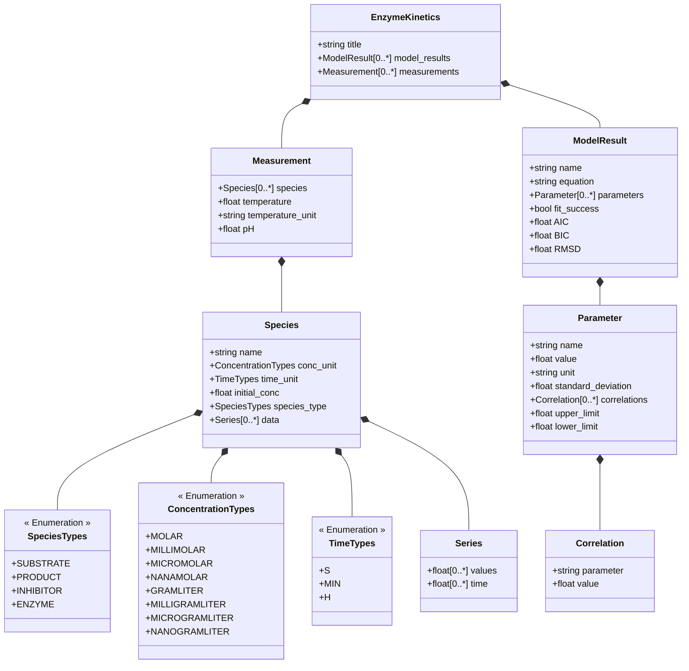

```mermaid
classDiagram
    EnzymeKinetics *-- Measurement
    EnzymeKinetics *-- ModelResult
    Species *-- SpeciesTypes
    Species *-- ConcentrationTypes
    Species *-- TimeTypes
    Species *-- Series
    Measurement *-- Species
    ModelResult *-- Parameter
    Parameter *-- Correlation
    
    class EnzymeKinetics {
        +string title
        +ModelResult[0..*] model_results
        +Measurement[0..*] measurements
    }
    
    class Species {
        +string name
        +ConcentrationTypes conc_unit
        +TimeTypes time_unit
        +float initial_conc
        +SpeciesTypes species_type
        +Series[0..*] data
    }
    
    class Measurement {
        +Species[0..*] species
        +float temperature
        +string temperature_unit
        +float pH
    }
    
    class ModelResult {
        +string name
        +string equation
        +Parameter[0..*] parameters
        +bool fit_success
        +float AIC
        +float BIC
        +float RMSD
    }
    
    class Parameter {
        +string name
        +float value
        +string unit
        +float standard_deviation
        +Correlation[0..*] correlations
        +float upper_limit
        +float lower_limit
    }
    
    class Correlation {
        +string parameter
        +float value
    }
    
    class Series {
        +float[0..*] values
        +float[0..*] time
    }
    
    class SpeciesTypes {
        << Enumeration >>
        +SUBSTRATE
        +PRODUCT
        +INHIBITOR
        +ENZYME
    }
    
    class ConcentrationTypes {
        << Enumeration >>
        +MOLAR
        +MILLIMOLAR
        +MICROMOLAR
        +NANAMOLAR
        +GRAMLITER
        +MILLIGRAMLITER
        +MICROGRAMLITER
        +NANOGRAMLITER
    }
    
    class TimeTypes {
        << Enumeration >>
        +S
        +MIN
        +H
    }
    
```