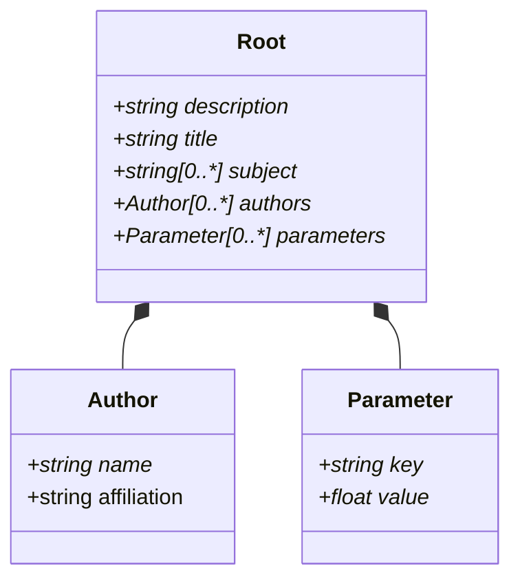

```mermaid
classDiagram
    Root *-- Author
    Root *-- Parameter
    
    class Root {
        +string description*
        +string title*
        +string[0..*] subject*
        +Author[0..*] authors*
        +Parameter[0..*] parameters*
    }
    
    class Author {
        +string name*
        +string affiliation
    }
    
    class Parameter {
        +string key*
        +float value*
    }
    
```